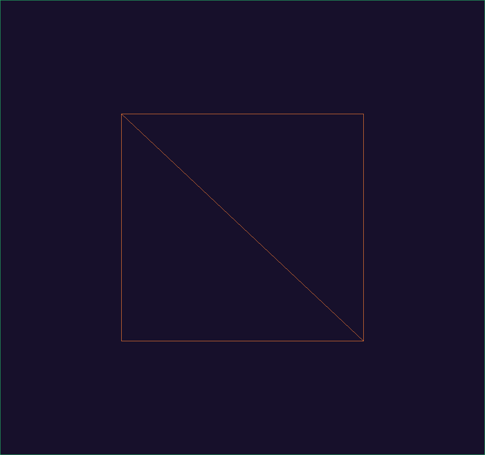
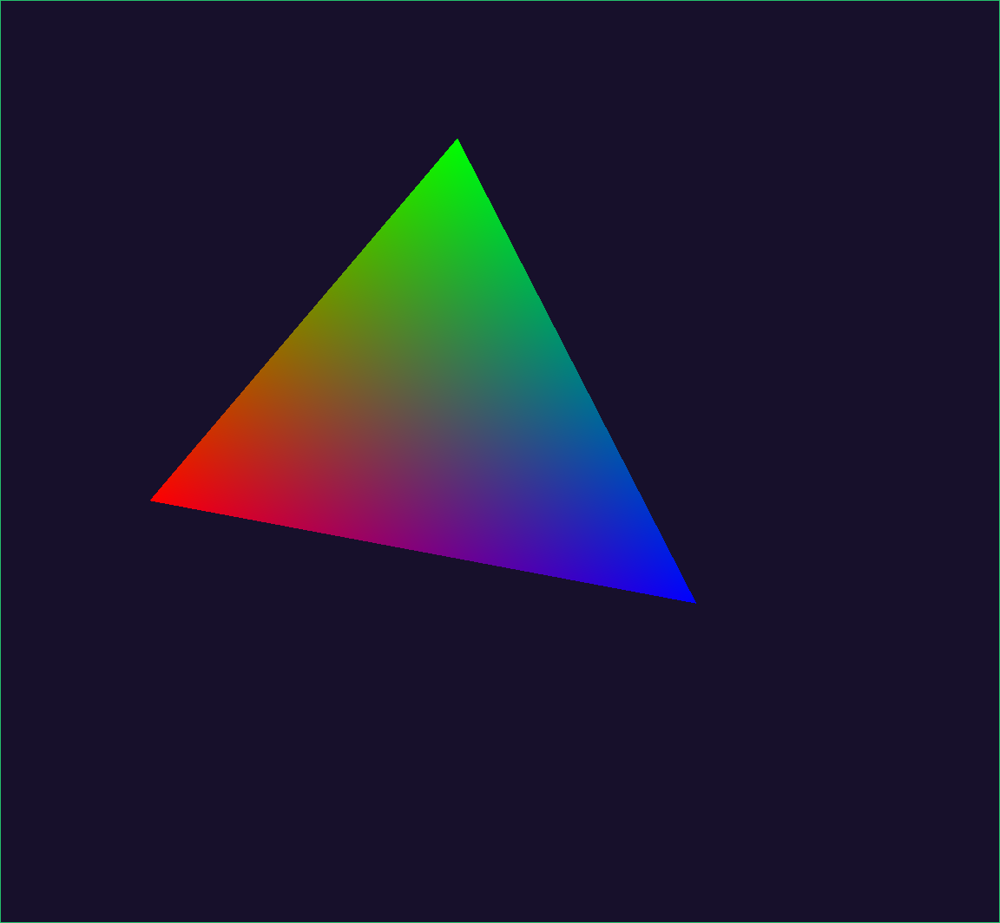
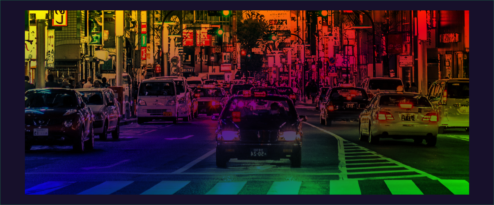
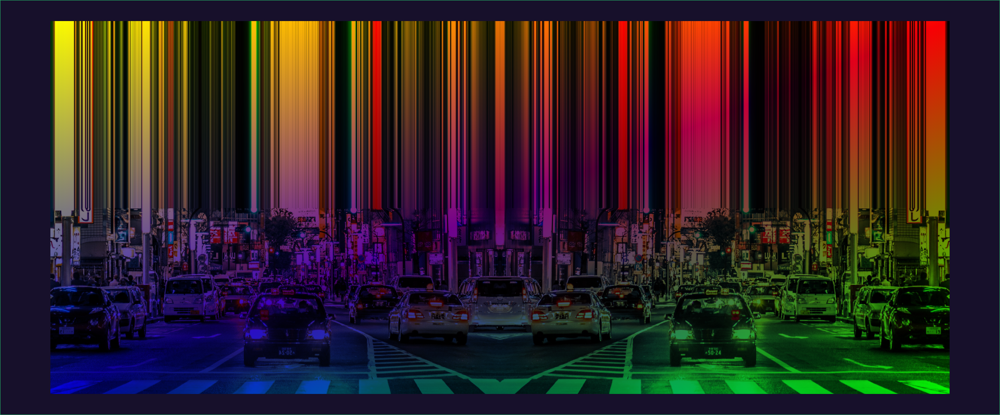

# What is this?

Just messing around with OpenGL. Learning how to use it and make fun stuff.

PS: The green outline around the screenshots are from DWM. They can stay for now

# Triangle
hmm yes, a triangle

# Shaders
A spinning triangle. Shader handling is now done in the shader module.

It spins. You either need to run it, or just take my word for it.

# Textures
Displaying an image using textures.. and adding color overlay.

Super basic, but I think that the stretch effect looks sweet.

